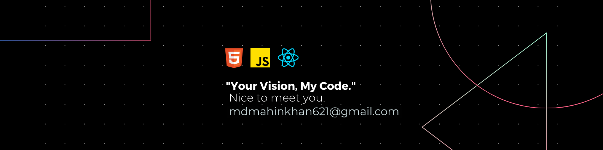

  

# Hi, I'm Mahin Khan 👋  
🚀 MERN Stack Developer | Frontend Developer | Open to Work

---

## 🌟 About Me

I’m a passionate and self-motivated **MERN Stack Developer** from Bangladesh. I recently completed the Programming Hero Web Development course and have been building real-world full-stack applications to sharpen my skills. My goal is to become a skilled **Full-Stack Developer** and work with innovative tech teams to solve real-world problems. I’m currently learning backend development and actively seeking internship or junior developer opportunities.

---

## 🧠 Tech Stack

  

---

## 🚧 Current Focus
- Learning advanced backend development with Node.js and Express.js  
- Building SaaS applications using the MERN stack  
- Applying for internships and junior developer roles  

---

## 🚀 Featured Project

### 🎓 Eduverse  
An educational platform where users can explore and purchase online courses. Features include secure user authentication, role-based access (admin, instructor, student), and Stripe payment integration.  
- 🌐 Live Site: [eduverse-sm.netlify.app](https://eduverse-sm.netlify.app/)  
- 🔗 [Client Repository](https://github.com/Programming-Hero-Web-Course4/b11a11-client-side-samir-45)  
- 🔗 [Server Repository](https://github.com/Programming-Hero-Web-Course4/b11a11-server-side-samir-45)  

More exciting projects coming soon...

---

## 🏆 Achievements & Certifications
- ✅ Completed Web Development Course from **Programming Hero**

---

## 📊 GitHub Stats

  

  

---

## 📫 Connect with Me

- 📧 Email: mdmahinkhan621@gmail.com  
- 💼 [LinkedIn](https://www.linkedin.com/in/mahin-khan-277531331/)  
- 🌐 [Facebook](https://www.facebook.com/mdmahin464)  

---

## 💡 Fun Facts

- 🧠 I love turning ideas into real projects  
- 🕹️ Coding is both my hobby and my hustle  
- 🌍 Dreaming to work internationally as a developer  
- 🎯 "Code is like humor. When you have to explain it, it’s bad." — Cory House

---

> ✨ “Stay hungry, stay foolish.” – Steve Jobs

